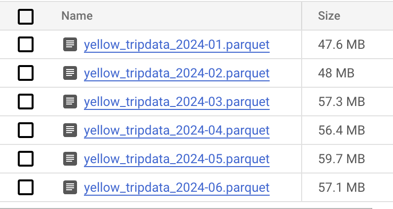
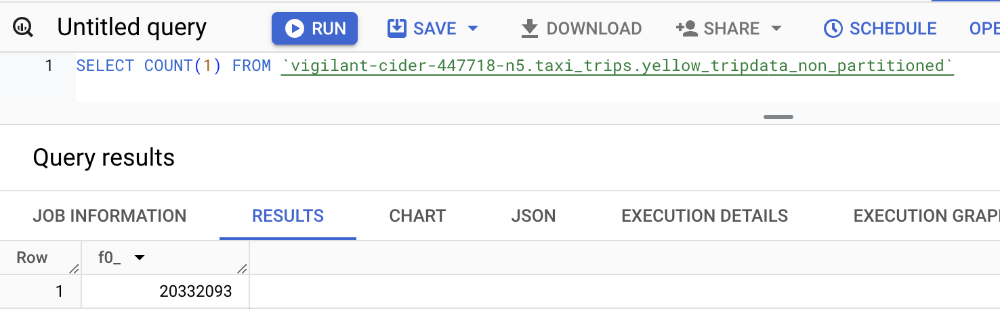
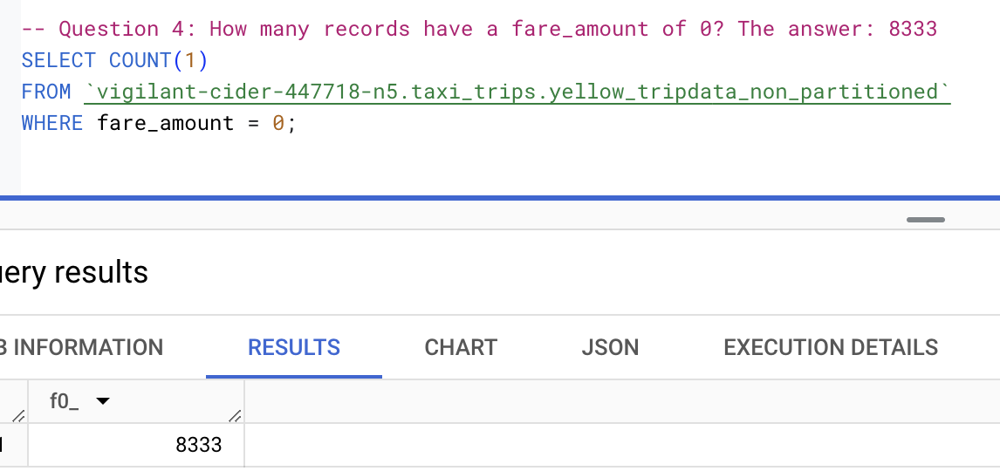

## Module 3 Homework

<b><u>Important Note:</b></u> <p> For this homework we will be using the Yellow Taxi Trip Records for **January 2024 - June 2024 NOT the entire year of data**
Parquet Files from the New York
City Taxi Data found here: </br> <https://www.nyc.gov/site/tlc/about/tlc-trip-record-data.page> </br>
If you are using orchestration such as Kestra, Mage, Airflow or Prefect etc. do not load the data into Big Query using the orchestrator.</br>
Stop with loading the files into a bucket. </br></br>

**Load Script:** 
I was using kestra so I loaded using the following script [Kestra script](./kestra.yml)

Nothing is fool proof so make sure that all 6 files show in your GCS Bucket before begining.


<u>NOTE:</u> You will need to use the PARQUET option files when creating an External Table</br>

<b>BIG QUERY SETUP:</b></br>
Create an external table using the Yellow Taxi Trip Records. </br>

Create a (regular/materialized) table in BQ using the Yellow Taxi Trip Records (do not partition or cluster this table). </br>


 ```SQL
-- Create an external table
CREATE OR REPLACE EXTERNAL TABLE `vigilant-cider-447718-n5.taxi_trips.external_yellow_tripdata`
OPTIONS (
  format = 'PARQUET',
  uris = ['gs://ata_clean/yellow_tripdata_2024-*.parquet']
);

-- Create a non partitioned table from external table
CREATE OR REPLACE TABLE vigilant-cider-447718-n5.taxi_trips.yellow_tripdata_non_partitioned AS
SELECT * FROM vigilant-cider-447718-n5.taxi_trips.external_yellow_tripdata;
```


## Question 1

Question 1: What is count of records for the 2024 Yellow Taxi Data?

The answer is : **20,332,093**

```SQL
SELECT COUNT(1) 
FROM `vigilant-cider-447718-n5.taxi_trips.yellow_tripdata_non_partitioned`;
```


## Question 2

Write a query to count the distinct number of PULocationIDs for the entire dataset on both the tables.</br>
What is the **estimated amount** of data that will be read when this query is executed on the External Table and the Table?

The answer is : **0 MB for the External Table and 155.12 MB for the Materialized Table**
```SQL
SELECT COUNT(DISTINCT PULocationID) 
FROM `vigilant-cider-447718-n5.taxi_trips.external_yellow_tripdata`;
-- This query will process 0 B when run.
SELECT COUNT(DISTINCT PULocationID) 
FROM `vigilant-cider-447718-n5.taxi_trips.yellow_tripdata_non_partitioned`;
-- This query will process 155.12 MB when run.
```


## Question 3

Write a query to retrieve the PULocationID from the table (not the external table) in BigQuery. Now write a query to retrieve the PULocationID and DOLocationID on the same table. Why are the estimated number of Bytes different?

The answer is : **BigQuery is a columnar database, and it only scans the specific columns requested in the query. Querying two columns (PULocationID, DOLocationID) requires
reading more data than querying one column (PULocationID), leading to a higher estimated number of bytes processed.**
```SQL
-- Now write a query to retrieve the PULocationID and DOLocationID on the same table. Why are the estimated number of Bytes different?
SELECT PULocationID FROM `vigilant-cider-447718-n5.taxi_trips.yellow_tripdata_non_partitioned`;
-- This query will process 155.12 MB when run.
SELECT PULocationID, DOLocationID FROM `vigilant-cider-447718-n5.taxi_trips.yellow_tripdata_non_partitioned`;
-- This query will process 310.24 MB when run.
```


## Question 4

How many records have a fare_amount of 0?

The answer is : **8,333**

```SQl
SELECT COUNT(1) 
FROM `vigilant-cider-447718-n5.taxi_trips.yellow_tripdata_non_partitioned` 
WHERE fare_amount = 0;
```


## Question 5

What is the best strategy to make an optimized table in Big Query if your query will always filter based on tpep_dropoff_datetime and order the results by VendorID (Create a new table with this strategy)

The answer is : **Partition by tpep_dropoff_datetime and Cluster on VendorID**
```SQL
CREATE OR REPLACE TABLE `vigilant-cider-447718-n5.taxi_trips.yellow_tripdata_partitioned_clustered` 
PARTITION BY DATE(tpep_dropoff_datetime)
CLUSTER BY VendorID AS
(SELECT * FROM `vigilant-cider-447718-n5.taxi_trips.yellow_tripdata_non_partitioned`);
```
-- Partitioning by Time: Time-based queries (like aggregating rides per day or filtering by a specific time range) can be processed more efficiently with partitioning, since only relevant time slices are read.
-- Clustering by Vendor: Once the relevant time-based partitions are identified, clustering by VendorID ensures that the system efficiently handles operations and queries that are vendor-specific.

## Question 6

Write a query to retrieve the distinct VendorIDs between tpep_dropoff_datetime
2024-03-01 and 2024-03-15 (inclusive)</br>

Use the materialized table you created earlier in your from clause and note the estimated bytes. Now change the table in the from clause to the partitioned table you created for question 5 and note the estimated bytes processed. What are these values? </br>

Choose the answer which most closely matches.</br>

The answer is : **310.24 MB for non-partitioned table and 26.84 MB for the partitioned table**

```SQL
SELECT DISTINCT VendorID 
FROM `vigilant-cider-447718-n5.taxi_trips.yellow_tripdata_non_partitioned`
WHERE tpep_dropoff_datetime BETWEEN  '2024-03-01' and '2024-03-15';
-- This query will process 310.24 MB when run.
SELECT DISTINCT VendorID 
FROM `vigilant-cider-447718-n5.taxi_trips.yellow_tripdata_partitioned_clustered`
WHERE tpep_dropoff_datetime BETWEEN  '2024-03-01' and '2024-03-15';
-- This query will process 26.84 MB when run.
```

## Question 7

Where is the data stored in the External Table you created?

The answer is : **GCP Bucket**
External Table in BigQuery refers to a table that does not store data inside BigQuery but instead references data stored externally.


## Question 8

It is best practice in Big Query to always cluster your data: **False**
- We only use it when it improves performance
```
Clustering should be avoided when:
- The dataset is small (clustering overhead outweighs benefits).
- The column chosen has low cardinality (e.g., only a few unique values).
- Queries do not filter or sort by the clustered column.
- The table is heavily updated, as clustering cannot be modified after table creation.
```

## (Bonus: Not worth points) Question 9

Write a `SELECT count(*)` query FROM the materialized table you created. How many bytes does it estimate will be read? Why?
```SQL
SELECT count(*) 
FROM `vigilant-cider-447718-n5.taxi_trips.yellow_tripdata_partitioned_clustered`;
-- This query will process 0 B when run.
-- BigQuery might only perform metadata checks, which doesn’t require reading the actual data, resulting in zero bytes processed.
```
You can find attached the file with all queries [BigQuery.sql](homework3.sql)

### GGWP