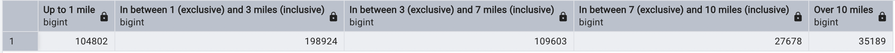
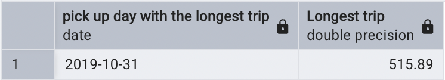
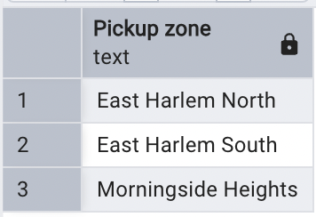
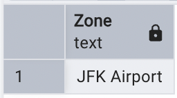

# Module 1 Homework: Docker & SQL

## Question 1. Understanding Docker first run

Run Docker with the `python:3.12.8` image in an interactive mode, using the entrypoint `bash`.

### **What’s the version of `pip` in the image?**

- **24.3.1**
- 24.2.1
- 23.3.1
- 23.2.1

**Approach:**

1. **Command in Bash:**
   ```bash
   docker run --rm python:3.12.8 bash -c 'pip --version'
   ```

   The output confirms that the `pip` version is **24.3.1**.

2. **Dockerfile Approach:**

   - Create a `Dockerfile` ([dockerfile](./dockerfile)):

     ```dockerfile
     # Use the Python 3.12.8 image
     FROM python:3.12.8

     # Set the entrypoint to bash
     ENTRYPOINT ["bash", "-c"]

     # Run the command to check pip version
     CMD ["pip --version"]
     ```

   - Build and run the Docker image:

     ```bash
     docker build -t python-pip-check .
     docker run python-pip-check
     ```

   The result is the same: **24.3.1**.

---

## Question 2. Understanding Docker networking and docker-compose

Given the following [docker-compose](./docker-compose.yaml), what is the `hostname` and `port` that **pgadmin** should use to connect to the Postgres database?

```yaml
services:
  db:
    container_name: postgres
    image: postgres:17-alpine
    environment:
      POSTGRES_USER: 'postgres'
      POSTGRES_PASSWORD: 'postgres'
      POSTGRES_DB: 'ny_taxi'
    ports:
      - '5433:5432'
    volumes:
      - vol-pgdata:/var/lib/postgresql/data

  pgadmin:
    container_name: pgadmin
    image: dpage/pgadmin4:latest
    environment:
      PGADMIN_DEFAULT_EMAIL: "pgadmin@pgadmin.com"
      PGADMIN_DEFAULT_PASSWORD: "pgadmin"
    ports:
      - "8080:80"
    volumes:
      - vol-pgadmin_data:/var/lib/pgadmin  

volumes:
  vol-pgdata:
    name: vol-pgdata
  vol-pgadmin_data:
    name: vol-pgadmin_data
```

**Answer:** `db:5432`

### **Explanation:**

- The `hostname` is `db` because that’s the service name used in the `docker-compose.yaml` file.
- The `port` is `5432` because the database container exposes its internal port `5432`.
- Why not the other options?
  - `postgres:5433`: Incorrect because `postgres` is not the hostname.
  - `localhost:5432`: Incorrect because `localhost` refers to the host machine, not the Docker network.
  - `db:5433`: Incorrect because the internal port of the Postgres service is `5432`.

---

## Prepare Postgres

Run Postgres and load data as shown in the videos.

We'll use the green taxi trips from October 2019:

```bash
wget https://github.com/DataTalksClub/nyc-tlc-data/releases/download/green/green_tripdata_2019-10.csv.gz
```

You will also need the dataset with zones:

```bash
wget https://github.com/DataTalksClub/nyc-tlc-data/releases/download/misc/taxi_zone_lookup.csv
```

After downloading the data files into the same directory, we use the following [notebook](ingest_data.ipynb) to ingest the data into the PostgreSQL database. Once the data is successfully loaded, we can utilize pgAdmin to connect to the database and query the data as needed.

---

## Question 3. Trip Segmentation Count

During the period of October 1st, 2019 (inclusive) and November 1st, 2019 (exclusive), how many trips, respectively, happened:
1. Up to 1 mile
2. In between 1 (exclusive) and 3 miles (inclusive)
3. In between 3 (exclusive) and 7 miles (inclusive)
4. In between 7 (exclusive) and 10 miles (inclusive)
5. Over 10 miles

**Answer:**

- **104,802; 198,924; 109,603; 27,678; 35,189**

**Approach:**

1. Ingest the data into Postgres using the provided CSV files.
2. Use SQL queries to calculate the segmentation counts:

   ```sql
   SELECT 
       COUNT(CASE WHEN trip_distance <= 1 THEN 1 END) AS "Up to 1 mile",
       COUNT(CASE WHEN trip_distance > 1 AND trip_distance <= 3 THEN 1 END) AS "In between 1 (exclusive) and 3 miles (inclusive)",
       COUNT(CASE WHEN trip_distance > 3 AND trip_distance <= 7 THEN 1 END) AS "In between 3 (exclusive) and 7 miles (inclusive)",
       COUNT(CASE WHEN trip_distance > 7 AND trip_distance <= 10 THEN 1 END) AS "In between 7 (exclusive) and 10 miles (inclusive)",
       COUNT(CASE WHEN trip_distance > 10 THEN 1 END) AS "Over 10 miles"
   FROM 
       green_trips_data
   WHERE
       lpep_dropoff_datetime >= '2019-10-01' AND lpep_dropoff_datetime < '2019-11-01';
   ```

   

---

## Question 4. Longest trip for each day

Which was the pickup day with the longest trip distance? Use the pickup time for your calculations.

**Answer:**

- **2019-10-31**

**Approach:**

1. Use the following SQL query to find the longest trip distance in a day:

   ```sql
   SELECT 
       DATE(lpep_pickup_datetime) AS "Pick-up day with the longest trip",
       MAX(trip_distance) AS "Longest trip"
   FROM
       green_trips_data
   GROUP BY
       DATE(lpep_pickup_datetime)
   ORDER BY
       MAX(trip_distance) DESC
   LIMIT 1;
   ```

   

---
## Question 5. Three biggest pickup zones

Which were the top pickup locations with over 13,000 in `total_amount` (across all trips) for 2019-10-18? Consider only `lpep_pickup_datetime` when filtering by date.

**Answer:**

- **East Harlem North, East Harlem South, Morningside Heights**

**Approach:**

1. Use the following SQL query:

   ```sql
    SELECT 
      taxi_zone."Zone" AS "Pickup zone"
    FROM 
      green_trips_data 
    JOIN
      taxi_zone ON green_trips_data."PULocationID" = taxi_zone."LocationID"
    WHERE 
      green_trips_data.lpep_pickup_datetime::DATE = '2019-10-18'
    GROUP BY 
      1
    HAVING 
        SUM(green_trips_data.total_amount) > 13000
    ORDER BY 
      SUM(green_trips_data.total_amount) DESC
    LIMIT 3;
   ```

   

---
## Question 6. Largest tip

For the passengers picked up in October 2019 in the zone named "East Harlem North," which was the drop-off zone that had the largest tip? Note: It’s `tip`, not `trip`.

**Answer:**

- **JFK Airport**

**Approach:**

1. Use the following SQL query:

   ```sql
    with pu_east_harlem as (
      select "DOLocationID" do_location, max(tip_amount) mx_tip
      from green_trips_data
      join taxi_zone on green_trips_data."PULocationID" = taxi_zone."LocationID"
      where lpep_pickup_datetime::date BETWEEN '2019-10-01' and '2019-10-31'
      and "Zone" = 'East Harlem North'
      group by 1
      order by mx_tip desc
    )
    select "Zone"
    from pu_east_harlem
    join taxi_zone on pu_east_harlem.do_location = taxi_zone."LocationID"
    order by mx_tip desc
    limit 1;
   ```

   

---
## Question 7. Terraform Workflow

Which of the following sequences, respectively, describes the workflow for:

1. Downloading the provider plugins and setting up backend,
2. Generating proposed changes and auto-executing the plan
3. Removing all resources managed by Terraform

**Answer:**

- **terraform init, terraform apply -auto-approve, terraform destroy**

